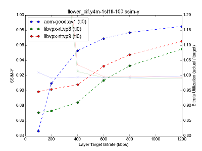
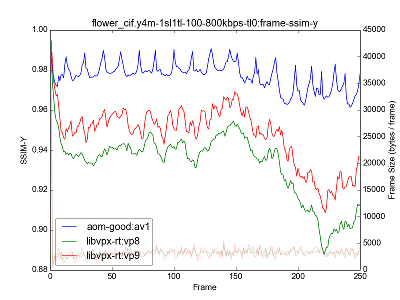

# Measuring Video Codec Performance

_This is not an official Google product._

This project contains a couple of scripts that can be used to generate quality
metrics and graphs for different video codecs, encoders and settings.

Quality metrics can be generated for `.y4m` as well as `.yuv` raw I420 video
files. `.yuv` files require the special format `clip.WIDTH_HEIGHT.yuv:FPS` since
width, height and fps metadata are not available in this containerless format.

A set of industry-standard clips that can be used are available at
[Xiph.org Video Test Media](https://media.xiph.org/video/derf/), aka. "derf's
collection".

## Dependencies

To build pinned versions of dependencies, comparison tools and libvpx run:

    $ ./setup.sh

This requires `git` and build dependencies for libvpx that are not listed here.
See build instructions for libvpx for build dependencies.

To use `.y4m` files as input (instead of `.yuv`), `mediainfo` and `ffmpeg` are
both required (to extract metadata and convert to `.yuv`). They can either be
built and installed from source or likely by running (or similar depending on
distribution):

    $ sudo apt-get install ffmpeg mediainfo

## Encoders

After building dependencies with `./setup.sh` libvpx encoders are available.
Additional encoders have to be fetched and built by using their corresponding
setup scripts.

`libvpx-rt:vp8` and `libvpx-rt:vp9` use libvpx encoders with settings as close
as possible to settings used by Chromium's [WebRTC](https://code.webrtc.org)
implementation.

_TODO(pbos): Add reasonable non-realtime settings for `--good` and `--best`
settings as `libvpx-good` and `libvpx-best` encoders for comparison with
`aom-good`._

### libyami

To build pinned versions of libyami, VA-API and required utils run:

    $ ./setup_yami.sh

Using libyami encoders (`yami:vp8`, `yami:vp9`) requires VA-API hardware
encoding support that's at least available on newer Intel chipsets. Hardware
encoding support can be probed for with `vainfo`.

### aomedia

To build pinned versions of [aomedia](http://aomedia.org/) utils run:

    $ ./setup_aom.sh

This permits encoding and evaluating quality for the AV1 video codec by running
the encoder pair `aom-good:av1`. This runs a runs `aomenc` with `--good`
configured as a 2-pass non-realtime encoding. This is significantly slower than
realtime targets but provides better quality.

_There's currently no realtime target for AV1 encoding as the codec isn't
considered realtime ready at the point of writing. When it is, `aom-rt` should
be added and runs could then be reasonably compared to other realtime encoders
and codecs._

### OpenH264

To build pinned versions of OpenH264, run:

    $ ./setup_openh264.sh

OpenH264 is a single-pass encoder used in WebRTC both in Chrome and Firefox.
This adds the `openh264:h264` which runs `h264enc` with settings that are
intended to be close to WebRTC's implementation.

## Generating Data

To generate graph data (after building and installing dependencies), see:

    $ ./generate_data.py --help

Example usage:

    $ ./generate_data.py --out=libvpx-rt.txt --encoders=libvpx-rt:vp8,libvpx-rt:vp9 clip1.320_240.yuv:30 clip2.320_180.yuv:30 clip3.y4m

This will generate `libvpx-rt.txt` with an array of Python dictionaries with
metrics used later to build graphs. This part takes a long time (may take hours
or even days depending on clips, encoders and configurations) as multiple clips
are encoded using various settings. Make sure to back up this file after running
or risk running the whole thing all over again.

To preserve encoded files, supply the `--encoded-file-dir` argument.

### VMAF

Graph data can be optionally supplemented with
[VMAF](https://github.com/Netflix/vmaf) metrics. To build a pinned version of
VMAF, run:

    $ ./setup_vmaf.sh

This requires several additional dependencies that are not listed here.
See build instructions for VMAF for build dependencies.

To enable the creation of VMAF metrics, supply the `--enable-vmaf` argument to
`generate_data.py`.

### System Binaries

To use system versions of binaries (either installed or otherwise available in
your `PATH` variable), supply `--use-system-path` to `generate_data.py`. This
will fall back to locally-compiled binaries (but warn) if the encoder commands
are not available in `PATH`.

## Dumping Encoder Commands

For debugging and reproducing (if you're working on encoders) it can be useful
to know which encoder command produced a certain data point.

To dump the commands used to generate data instead of running them, supply
`--dump-commands` to `generate_data.py`.

## Generating Graphs

To generate graphs from existing graph data run:

    $ generate_graphs.py --out-dir OUT_DIR graph_file.txt [graph_file.txt ...]

This will generate several graph image files under `OUT_DIR` from data files
generated using `generate_data.py`, where each clip and temporal/spatial
configuration are grouped together to generate graphs comparing different
encoders and layer performances for separate `SSIM`, `AvgPSNR` and `GlbPSNR`
metrics. Multiple encoders and codecs are placed in the same graphs to enable a
comparison between them.

The script also generates graphs for encode time used. For speed tests it's
recommended to use a SSD or similar, along with a single worker instance to
minimize the impact that competing processes and disk/network drive performance
has on time spent encoding.

_The scripts make heavy use of temporary filespace. Every worker instance uses
disk space roughly equal to a few copies of the original raw video file that is
usually huge to begin with. To solve or mitigate issues where disk space runs
out during graph-data generation, either reduce the amount of workers used with
`--workers` or use another temporary directory (with more space available) by
changing the `TMPDIR` environment variable._

## Adding or Updating Encoder Implementations

Adding support for additional encoders are encouraged. This requires adding an
entry under `generate_data.py` which handles the new encoder, optionally
including support for spatial/temporal configurations.

Any improvements upstream to encoder implementations have to be pulled in by
updating pinned revision hashes in corresponding setup/build scripts.
